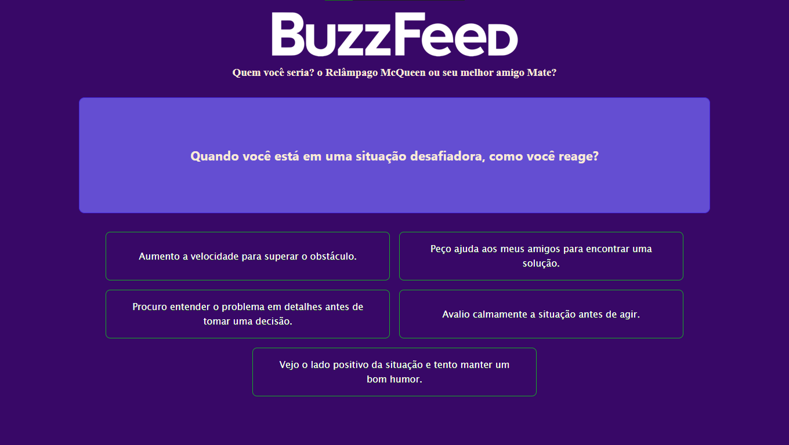
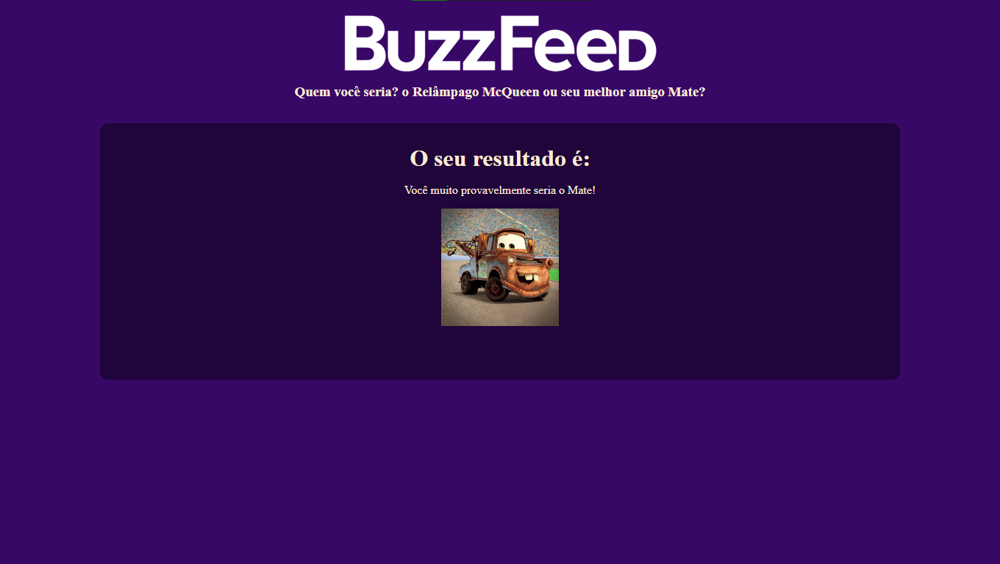

# Quiz dos Carros

Este é um projeto inspirado nos quizzes do BuzzFeed, onde você poderá descobrir se é mais parecido com o Relâmpago McQueen ou o Mate, personagens da franquia Carros da Disney Pixar. O quiz foi desenvolvido em Angular e aborda conceitos como diretivas, algoritmos básicos de quiz, HTML, CSS, e conceitos de data-binding.

## Funcionalidades

- Quiz interativo para descobrir sua afinidade com os personagens de Carros.
- Utiliza Angular para criar uma experiência dinâmica e envolvente.
- Apresenta uma série de perguntas com opções de resposta.
- No final do quiz, revela se você é mais parecido com o Relâmpago McQueen ou o Mate.
- Possui um design inspirado no universo de Carros, com elementos visuais atraentes.

## Como Usar

1. Clone este repositório para sua máquina local.
2. Navegue até o diretório do projeto.
3. Instale as dependências utilizando o comando `npm install`.
4. Inicie a aplicação com o comando `ng serve`.
5. Acesse o quiz em seu navegador, utilizando o endereço `http://localhost:4200`.

## Screenshots

Insira aqui os screenshots do projeto:

Divirta-se descobrindo qual personagem de Carros você mais se parece!
